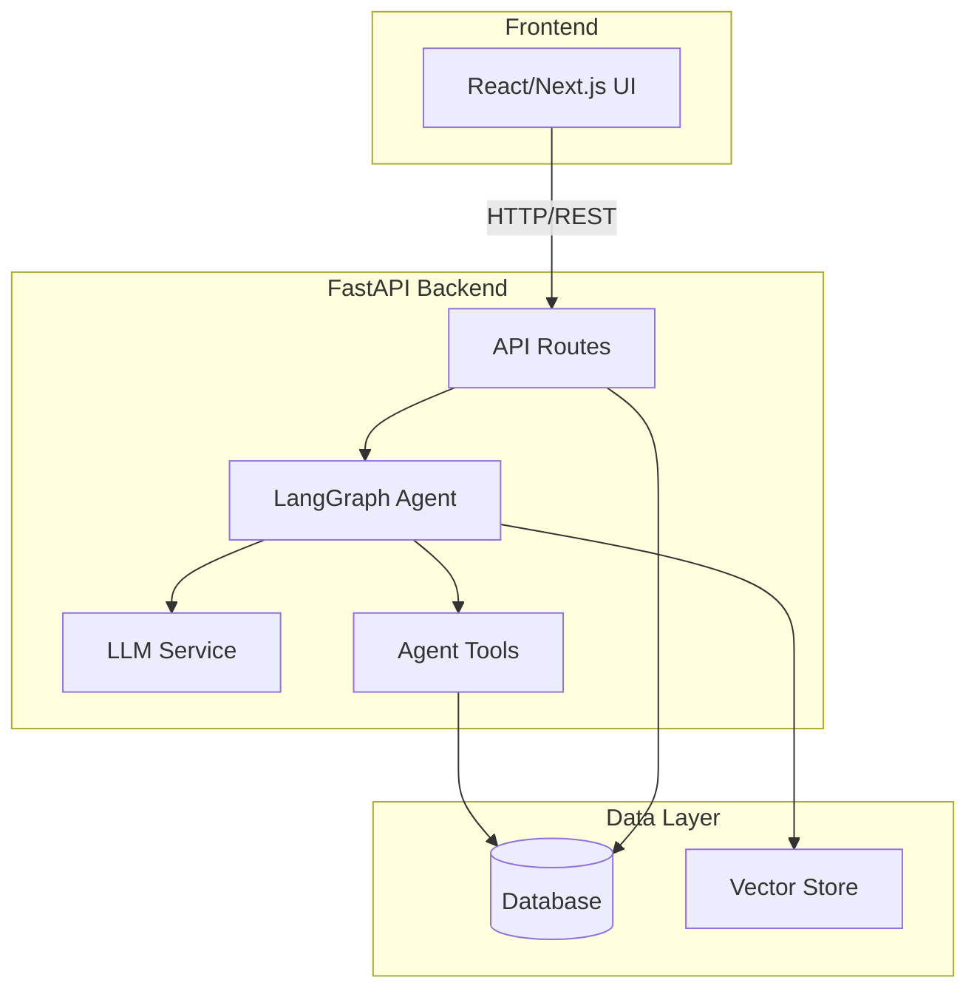
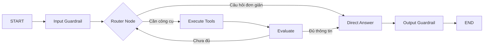
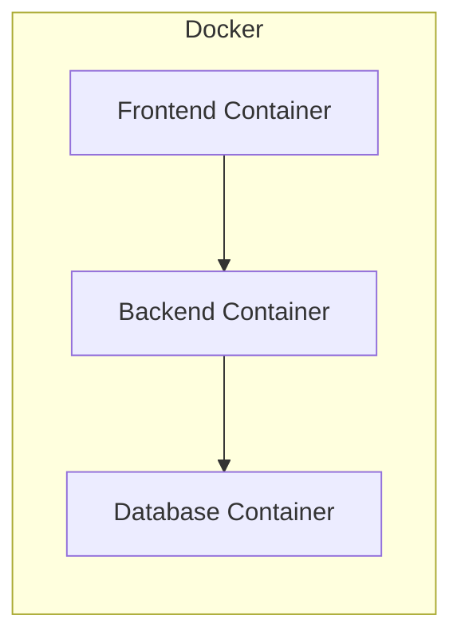

# Architecture Document

## System Overview

Dự án VinUni AI Lecture Assistant được phát triển theo kiến trúc 3 tầng chuẩn hóa, hỗ trợ đắc lực giảng viên thiết kế bài giảng, soạn storyboard slide hoạt động và tạo bộ câu hỏi thi trắc nghiệm theo chuẩn đầu ra (CLO) và thang Bloom.

## Architecture Diagram

## Components

### 1. Frontend (React/Next.js)
- **Purpose:** Cung cấp giao diện Web tương tác trực quan cho giảng viên.
- **Key Features:** ChatBot hỗ trợ, thiết kế bài giảng chi tiết (Storyboard/Materials), ngân hàng câu hỏi trắc nghiệm, quản lý môn học, thống kê coverage ma trận CLO x Bloom, và giám sát telemetry cuộc gọi LLM/chi phí.
- **State Management:** React useState/useEffect hooks và custom events để đồng bộ hóa trạng thái giữa các views và dashboards.

### 2. Backend (FastAPI)
- **Purpose:** API server xử lý business logic, quản lý phiên chat, phân quyền người dùng, lưu dữ liệu hệ thống, kết nối ChromaDB, và xoay vòng các LLM providers.
- **API Design:** RESTful
- **Authentication:** JWT token-based authentication (lưu trữ trong localStorage và truyền qua Header `Authorization: Bearer <token>`).

### 3. AI Agent (LangGraph)
- **Agent Type:** Custom State Machine Agent với cơ chế Intent Routing, Guardrail checking và Tool Execution.
- **State:** `AgentState` TypedDict chứa lịch sử hội thoại, câu hỏi hiện tại, kết quả truy tìm từ Vector RAG, và số lượt lặp tối đa của Agent.
- **Nodes:** Input Guardrails, Router, Web Search, DB Query, Evaluate, Generate Answer, Output Guardrails.
- **Tools:** `search_course_knowledge` (RAG Vector Store query), `get_course_clos`, `get_matrix_coverage`, `clarify`, `get_course_chapters`, `generate_course_outline_action`, `generate_chapter_storyboard_action`, `generate_chapter_materials_action`, `generate_chapter_questions_action`.
- **Flow:**

### 4. Database
- **Type:** SQLite (được cấu hình ở chế độ WAL để hỗ trợ ghi đồng thời nhẹ nhàng trong giai đoạn development) và PostgreSQL cho production.
- **Tables:** `users`, `courses`, `chapters`, `chapter_materials`, `questions`, `chat_sessions`, `chat_messages`, `chat_eval_runs`.
- **Migrations:** Alembic

### 5. Vector Store
- **Type:** ChromaDB (Persisted local client)
- **Embeddings:** SentenceTransformers (all-MiniLM-L6-v2), fallback sang OpenAI (text-embedding-3-small) hoặc Gemini (text-embedding-004).
- **Purpose:** Truy vấn RAG cô lập theo Course ID và User ID nhằm cung cấp ngữ cảnh học liệu chính xác khi sinh bài giảng và câu hỏi.

## Data Flow

1. User gửi request từ Frontend
2. API route nhận và validate input (Pydantic)
3. Agent xử lý qua LangGraph pipeline (hoặc Agent loop)
4. LLM generate response
5. Tools thực thi actions (nếu cần)
6. Response trả về Frontend qua API (SSE Stream hoặc JSON)

## Deployment Architecture

## Security

- API keys stored in `.env` (never commit)
- Input validation via Pydantic
- Rate limiting on API endpoints
- CORS configured for frontend domain
- Trình bắt lỗi toàn cục (Global Exception Handler) ẩn chi tiết kỹ thuật ở môi trường production.

## Design Decisions

| Decision | Choice | Reason |
|----------|--------|--------|
| Framework | FastAPI | Async, auto-docs, type-safe |
| Agent | LangGraph | Flexible state management |
| Database | SQLite & PostgreSQL | SQLite chạy local cực kỳ gọn nhẹ cho dev, PostgreSQL hỗ trợ chịu tải cao cho prod. |
| Frontend | Next.js | Hỗ trợ server-side routing kết hợp client-side rendering mượt mà, tối ưu SEO. |
