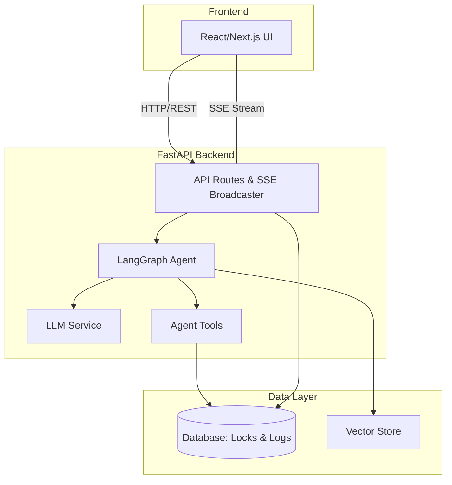

# 🎓 VinUni AI Lecture Assistant

> Giảng viên mất hàng giờ soạn giáo án → AI Agent tự động thiết kế bài giảng, storyboard slide, và ngân hàng câu hỏi theo chuẩn CLO & Bloom cho giảng viên VinUni.

## Vấn đề (Problem)

Giảng viên đại học tại VinUni dành trung bình **8-12 giờ/tuần** để:
- Soạn đề cương môn học chi tiết (course outline) theo chuẩn đầu ra CLO
- Thiết kế kịch bản hoạt động giảng dạy (storyboard) cho từng buổi học
- Tạo slide bài giảng và tài liệu đọc chi tiết
- Soạn ngân hàng câu hỏi trắc nghiệm theo thang tư duy Bloom

Các giải pháp hiện tại (Google Docs, PowerPoint thủ công) **không** đảm bảo tính nhất quán giữa CLO, nội dung giảng dạy, và đề thi.

## Giải pháp (Solution)

**VinUni AI Lecture Assistant** — hệ thống AI Agent end-to-end hỗ trợ giảng viên:

- 🧠 **AI Course Outline Generator:** Tự động sinh đề cương chi tiết từ syllabus, streaming từng chương qua SSE
- 📊 **CLO × Bloom Heatmap Matrix:** Trực quan hóa độ phủ chuẩn đầu ra, tính toán real-time ở client
- 🎯 **Storyboard & Slide Designer:** Timeline hoạt động Flexbox, slide preview 16:9, theme VinUni
- ❓ **Smart Question Bank:** Accordion cards, slider điều chỉnh độ khó, AI regenerate theo Bloom level
- 📤 **Export Engine:** Xuất PowerPoint (.pptx), Word (.docx), ZIP đóng gói — LaTeX → OMML
- 🤖 **Chatbot Trợ lý:** Side drawer AI hiểu ngữ cảnh trang hiện tại, RAG từ tài liệu môn học
- 🔒 **Autopilot & Locking:** AI chạy ngầm với SSE real-time sync, cơ chế khóa giao diện chống ghi đè

## Target User

- **Primary:** Giảng viên đại học VinUni cần soạn giáo án theo chuẩn CLO & Bloom
- **Secondary:** Trợ giảng (TA) hỗ trợ chuẩn bị tài liệu giảng dạy

## Tech Stack

| Layer | Technology | Version |
|-------|-----------|---------|
| AI Agent | LangGraph + LangChain | Latest |
| Backend | FastAPI + Uvicorn | 0.115+ |
| LLM | OpenAI GPT-4o-mini / Gemini / Claude | Multi-provider |
| Frontend | Next.js (React + TypeScript) | 14+ |
| Database | SQLite (dev) / PostgreSQL (prod) | WAL mode |
| Vector Store | ChromaDB + SentenceTransformers | all-MiniLM-L6-v2 |
| Migrations | Alembic | Latest |
| DevOps | Docker + GitHub Actions | Multi-stage |
| Testing | pytest + pytest-asyncio | 8+ |
| Monitoring | psutil + custom telemetry | Built-in |

## Quick Start

```bash
# 1. Clone repo
git clone https://github.com/AI20K-Build-Cohort-2/C2-App-023.git
cd C2-App-023

# 2. Setup environment
python3.11 -m venv .venv
source .venv/bin/activate
pip install -r requirements.txt

# 3. Configure API keys
cp .env.example .env
# Edit .env: add OPENAI_API_KEY, etc.

# 4. Install AI Logging Hooks
bash scripts/setup_hooks.sh

# 5. Run backend
uvicorn src.main:app --reload --port 8000
# Swagger UI: http://localhost:8000/docs

# 6. Run frontend
cd frontend && npm install && npm run dev
# App: http://localhost:3000
```

## Project Structure

```
├── src/
│   ├── agents/              # 🧠 LangGraph Agent
│   │   ├── graph.py         #    State graph (modular nodes + edges)
│   │   ├── state.py         #    AgentState TypedDict
│   │   ├── nodes/           #    Modular node functions
│   │   └── tools/           #    Agent tools (@tool decorators)
│   ├── api/                 # 🌐 FastAPI Backend (13 route modules)
│   │   ├── auth.py          #    JWT authentication
│   │   ├── courses.py       #    Course CRUD + materials upload
│   │   ├── outline.py       #    SSE streaming outline generation
│   │   ├── materials.py     #    Storyboard & slide management
│   │   ├── questions.py     #    Question bank CRUD + AI regenerate
│   │   ├── export.py        #    PPTX/DOCX/ZIP export engine
│   │   ├── chatbot.py       #    SSE chatbot with RAG context
│   │   ├── admin.py         #    Admin dashboard API
│   │   ├── autopilot.py     #    AI autopilot + SSE notifications
│   │   ├── trash.py         #    Soft-delete & restore
│   │   └── telemetry.py     #    System metrics & monitoring
│   ├── services/            # 🔧 Business logic (LLM, RAG, export)
│   ├── schemas/             # 📋 Pydantic schemas
│   ├── database/            # 💾 SQLAlchemy models + session
│   ├── prompts/             # 📝 LLM prompt templates
│   ├── utils/               # 🛠 Utilities (parser, cache, alerting)
│   ├── config.py            # ⚙️ Pydantic Settings
│   └── main.py              # 🚀 App entry point
├── frontend/                # 🎨 Next.js React Frontend
│   └── src/views/           #    14 view components
├── tests/                   # 🧪 308 tests (51% coverage)
│   ├── test_agents/         #    Agent/graph tests
│   ├── test_api/            #    API endpoint tests
│   ├── test_integration/    #    Integration tests
│   └── test_services/       #    Service layer tests
├── alembic/                 # 📦 Database migrations
├── eval/                    # 📊 Evaluation harness & results
├── docs/plans/              # 📖 7 implementation plans
├── presentation/            # 🎤 Demo Day materials
├── .ai-log/                 # 📊 AI usage logs (auto-generated)
├── Dockerfile               # 🐳 Multi-stage build
├── docker-compose.yml       # 🐙 Full stack orchestration
└── .github/workflows/       # ⚡ CI/CD pipeline
```

## API Endpoints

| Method | Path | Description |
|--------|------|-------------|
| POST | `/api/auth/login` | JWT authentication |
| POST | `/api/auth/register` | User registration |
| GET | `/api/courses` | List courses (paginated) |
| POST | `/api/courses` | Create course |
| POST | `/api/courses/{id}/materials` | Upload course materials (RAG) |
| POST | `/api/outline/generate` | SSE streaming outline generation |
| GET | `/api/outline/chapters/{id}` | Get chapter details |
| POST | `/api/materials/generate` | Generate storyboard & slides |
| GET | `/api/questions/{chapter_id}` | List questions |
| POST | `/api/questions/{id}/regenerate` | AI regenerate question |
| POST | `/api/export/pptx` | Export PowerPoint |
| POST | `/api/export/docx` | Export Word document |
| POST | `/api/export/all-zip` | Export all as ZIP |
| POST | `/api/chatbot/message` | SSE chatbot with RAG |
| GET | `/api/autopilot/notifications/stream` | SSE autopilot events |
| GET | `/api/admin/telemetry` | System metrics |
| GET | `/health` | Health check |

## Architecture



## Test Results

```
308 passed, 0 failed in 63s
Test coverage: 51%
Response accuracy: 66.7%
Response latency: < 3s target (Actual: 9.03s)
```

## Deliverables Checklist

- [x] Source Code (GitHub)
- [x] README.md (customized)
- [x] Architecture Diagram (`ARCHITECTURE.md` + `docs/architecture_diagram.md`)
- [x] AI Logs (auto-collected via hooks)
- [ ] Live URL / Deploy
- [ ] Video Demo
- [ ] Pitch Deck (`presentation/`)
- [x] Weekly Journal (`JOURNAL.md`)
- [x] Worklog (`WORKLOG.md`)
- [x] Evaluation Evidence (`eval/results/report.md`)

## Team

| Member | Role | Student ID |
|--------|------|-----------|
| Phạm Thành Nam | Full-stack Developer & AI Agent Engineer | — |
| Lê Thiên Khang | DevOps & Repository Management | — |

## License

MIT — Sử dụng tự do cho mục đích giáo dục.
