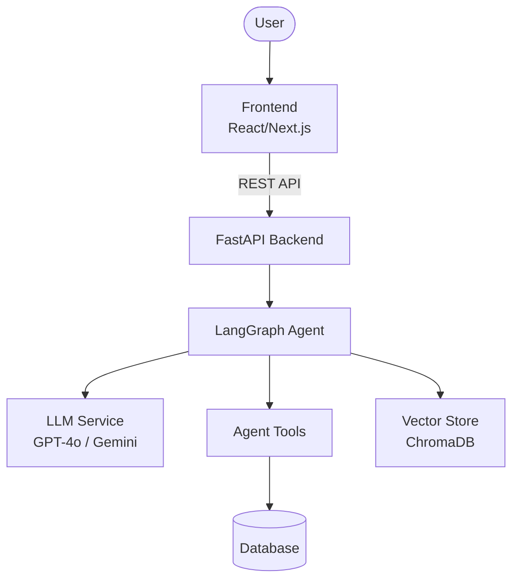
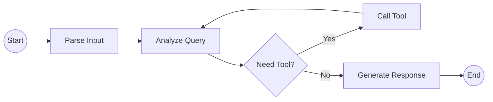

# Architecture Diagram

> [!NOTE]
> **Last updated:** 2026-06-09. This document is a simplified version; please refer to [ARCHITECTURE.md](file:///c:/Users/Admin/Documents/VinUni/CodeLab/C2-App-023/ARCHITECTURE.md) for the active, detailed system architecture.

## System Overview

## Agent Flow

## Component Details

| Component | Technology | Purpose |
|-----------|-----------|---------|
| Frontend | React/Next.js | User interface |
| Backend | FastAPI | API server |
| Agent | LangGraph | AI agent orchestration |
| LLM | OpenAI/Gemini | Language model |
| Database | PostgreSQL/SQLite | Data persistence |
| Vector Store | ChromaDB | RAG / embeddings |
