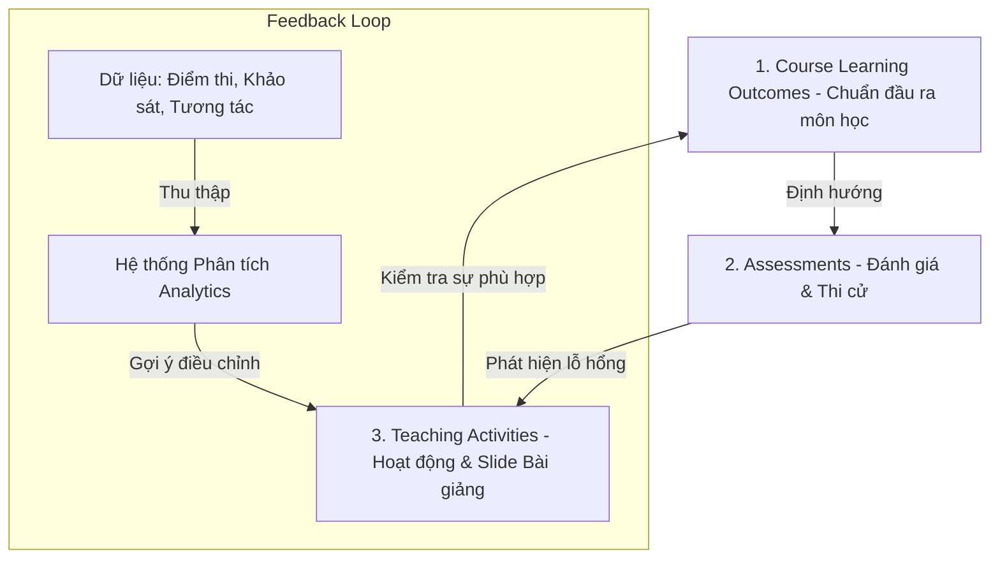
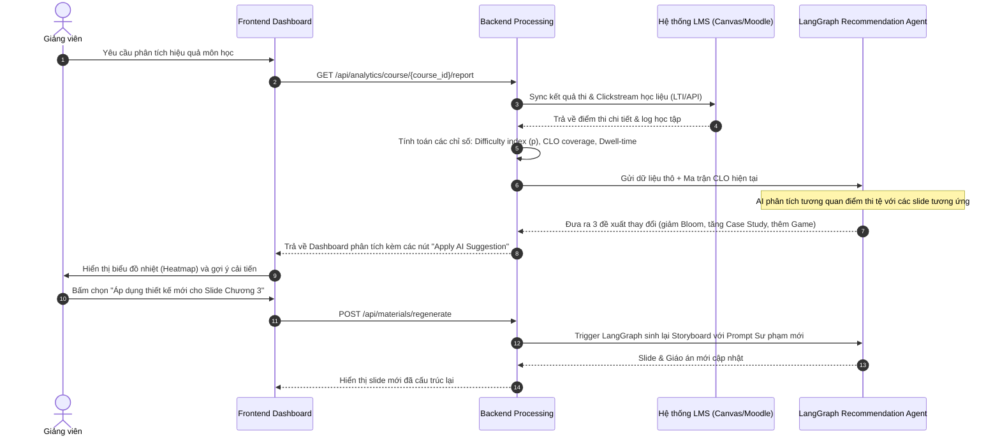

# 1. Khung Nghiệp vụ & Phương pháp Thu thập Dữ liệu Giảng dạy (Pedagogical Analytics Framework)

> [!NOTE]
> **Tài liệu Nghiên cứu Chuyên sâu**  
> **Phiên bản:** 1.0 (Bản thảo Hệ thống Phân tích & Tối ưu Bài giảng)  
> **Phát triển bởi:** Ban Nghiên cứu & Phát triển VinUni AI Lecture Assistant (Senior BA, Experienced Lecturer & Senior Full Stack)

---

## 1. Giới thiệu & Khung lý thuyết Cốt lõi (Pedagogical Alignment)

Trong giáo dục hiện đại, đặc biệt là theo tiêu chuẩn kiểm định quốc tế (như ABET, AACSB, CDIO), việc thiết kế bài giảng không còn là một quá trình tĩnh (static process) dựa hoàn toàn trên kinh nghiệm chủ quan của giảng viên. Thay vào đó, nó dựa trên nguyên lý **Constructive Alignment (Sự đồng bộ kiến tạo)** của John Biggs và **Bloom's Taxonomy (Thang đo Bloom tư duy)**.

Khung lý thuyết này yêu cầu:
1. **Chuẩn đầu ra (CLO - Course Learning Outcomes):** Định nghĩa sinh viên có thể làm được gì sau môn học.
2. **Hoạt động giảng dạy (Teaching Activities / Slides):** Được thiết kế để giúp sinh viên đạt được CLO đó.
3. **Đánh giá (Assessments / Questions):** Đo lường mức độ đạt được CLO của sinh viên.

Nếu kết quả thi (Assessments) cho thấy sinh viên gặp khó khăn ở một CLO cụ thể, điều đó đồng nghĩa với việc hoạt động giảng dạy (Teaching Activities) hoặc nội dung slide tương ứng với CLO đó cần được điều chỉnh.

---

## 2. Các nguồn dữ liệu & Phương pháp thu thập chuyên sâu

Dưới đây là chi tiết các phương pháp thu thập dữ liệu từ góc nhìn Nghiệp vụ (BA) và Sư phạm (Lecturer), kết hợp giải pháp Kỹ thuật (Full Stack).

### A. Phân tích kết quả thi và Đánh giá (Exam & Assessment Analytics)

Đây là nguồn dữ liệu định lượng (quantitative data) quan trọng nhất phản ánh trực tiếp hiệu quả học tập.

*   **Dưới góc nhìn Sư phạm (Lecturer):**
    *   **Phân tích độ khó (Difficulty Index - $p$):** Tỷ lệ sinh viên trả lời đúng một câu hỏi. Nếu $p < 0.3$, câu hỏi quá khó hoặc nội dung bài giảng chưa truyền tải đủ sâu. Nếu $p > 0.9$, câu hỏi quá dễ, không phân loại được học lực.
    *   **Phân tích độ phân hóa (Discrimination Index - $d$):** Đo lường khả năng phân biệt giữa nhóm học tốt (Top 27%) và nhóm học yếu (Bottom 27%). Nếu $d < 0.2$, câu hỏi có vấn đề (có thể bị mập mờ hoặc đáp án sai lệch), dẫn đến việc giảng dạy cần điều chỉnh thuật ngữ.
    *   **Phân tích phương án nhiễu (Distractor Analysis):** Xem xét tỷ lệ chọn các đáp án sai (distractors) trong câu hỏi trắc nghiệm (MCQ). Nếu sinh viên tập trung chọn một phương án sai cụ thể, chứng tỏ họ đang bị hiểu sai một cách có hệ thống (misconception) từ bài giảng.
*   **Dưới góc nhìn Hệ thống (Full Stack):**
    *   Thu thập điểm số chi tiết từng câu hỏi (Item-level grading score) từ các kỳ thi (Midterm, Final) và bài tập hàng tuần (Quizzes) trên LMS (Canvas/Moodle) thông qua LTI (Learning Tools Interoperability) hoặc REST API.
    *   Ánh xạ từng câu hỏi với mã CLO và Thang Bloom đã được định nghĩa trong cơ sở dữ liệu để tính toán phân bố điểm số theo từng mục tiêu học tập.

### B. Khảo sát ý kiến phản hồi (Student Surveys & Feedback)

Cung cấp dữ liệu định tính (qualitative) và cảm xúc (sentimental) của người học về bài giảng.

*   **Dưới góc nhìn Sư phạm (Lecturer):**
    *   **Mid-term Feedback (Khảo sát giữa kỳ):** Thực hiện ở tuần 5-6 để điều chỉnh kịp thời cho nửa sau học kỳ. Tập trung vào 3 câu hỏi: *Cái gì đang giúp bạn học tốt? Cái gì đang cản trở việc học? Đề xuất thay đổi cụ thể là gì?*
    *   **Student Evaluation of Teaching (SET - Khảo sát cuối kỳ):** Khảo sát chính thức của trường về cấu trúc môn học, tài liệu giảng dạy, và kỹ năng sư phạm của giảng viên.
*   **Dưới góc nhìn Hệ thống (Full Stack):**
    *   Tích hợp form khảo sát nhanh (Micro-surveys) ngay cuối mỗi chương học trên app di động hoặc web.
    *   Sử dụng xử lý ngôn ngữ tự nhiên (NLP Sentiment Analysis) trên các trường văn bản tự do (free-text comments) để gom nhóm các từ khóa tiêu cực liên quan đến bài giảng (ví dụ: "slide quá nhiều chữ", "giảng quá nhanh", "code demo chạy lỗi").

### C. Dữ liệu quá trình giảng dạy & Tương tác lớp học (In-class & LMS Engagement)

Đo lường mức độ tương tác thực tế của sinh viên với tài liệu học tập trước và trong giờ học.

*   **Dưới góc nhìn Sư phạm (Lecturer):**
    *   **Tỷ lệ hoàn thành bài đọc trước giờ (Flipped Classroom compliance):** Sinh viên có chuẩn bị bài trước khi lên lớp không? Nếu tỷ lệ này < 40%, giảng viên bắt buộc phải đổi phương pháp dạy trên lớp từ "thảo luận chuyên sâu" về lại "thuyết giảng cơ bản".
    *   **Mức độ tương tác thời gian thực (Real-time polling):** Kết quả các câu hỏi nhanh trong lớp (qua Kahoot, Mentimeter, hoặc Clickers).
*   **Dưới góc nhìn Hệ thống (Full Stack):**
    *   **Telemetry/Clickstream data:** Ghi nhận log sinh viên xem slide trực tuyến: thời gian dừng ở từng trang slide (dwell time), tỷ lệ tải về tài liệu, và số lần tua lại video bài giảng (nếu có).
    *   **LMS Analytics API:** Tracking số lần truy cập, thời gian online của sinh viên trên hệ thống quản lý học tập.

---

## 3. Bản đồ Nghiệp vụ: Quy trình Phản hồi & Cải tiến bài giảng

Dưới đây là sơ đồ quy trình thu thập và ra quyết định cải tiến giáo án, phối hợp giữa Giảng viên, BA và Hệ thống AI.

Tài liệu này đặt nền móng cho các chỉ số đo lường chi tiết và thiết kế cơ sở dữ liệu sẽ được trình bày ở các phần tiếp theo.
