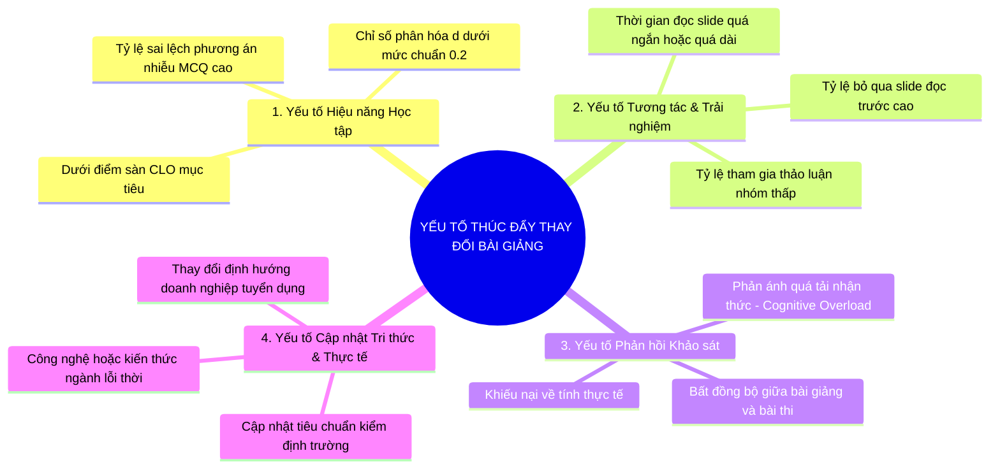

# 2. Các Yếu tố Thúc đẩy Thay đổi Phương pháp & Nội dung Giảng dạy (Lecture Change Drivers)

> [!NOTE]
> **Tài liệu Nghiên cứu Chuyên sâu**  
> **Phiên bản:** 1.0 (Bản thảo Hệ thống Phân tích & Tối ưu Bài giảng)  
> **Phát triển bởi:** Ban Nghiên cứu & Phát triển VinUni AI Lecture Assistant (Senior BA, Experienced Lecturer & Senior Full Stack)

---

Để cải tiến bài giảng hiệu quả, chúng ta cần xác định rõ **Khi nào một bài giảng cần thay đổi?** và **Thay đổi cái gì (Nội dung hay Phương pháp)?**. Dưới đây là mô hình phân loại các yếu tố tác động (Change Drivers) thành 4 nhóm chính, giúp hệ thống và giảng viên ra quyết định chính xác.

---

## 1. Chi tiết các nhóm yếu tố tác động (Change Drivers)

### Nhóm A: Yếu tố Hiệu năng Học tập (Performance-Driven Drivers)
Phản ánh trực tiếp mức độ tiếp thu kiến thức của sinh viên qua các bài kiểm tra.

*   **Tỷ lệ đạt mục tiêu CLO thấp:** Khi phân tích điểm số các câu hỏi thi ánh xạ vào một CLO cụ thể, nếu tỷ lệ sinh viên đạt yêu cầu (ví dụ: điểm $\ge 6.0/10.0$) thấp hơn $70\%$, đây là tín hiệu đỏ cho thấy nội dung giảng dạy của CLO đó đang gặp vấn đề.
*   **Chỉ số phân hóa (Discrimination Index) thấp dưới 0.2:** Cho thấy nhóm giỏi và nhóm yếu đều làm sai/làm đúng như nhau ở câu hỏi này. Sư phạm chỉ ra rằng bài học không làm rõ được các điểm mấu chốt dễ gây nhầm lẫn.
*   **Sự phân bố lỗi sai tập trung ở một phương án nhiễu (Systemic Misconception):** Nếu $60\%$ sinh viên chọn cùng một đáp án sai $B$ thay vì đáp án đúng $A$, chứng tỏ bài giảng có một điểm mờ khiến sinh viên hiểu sai một cách hệ thống.

### Nhóm B: Yếu tố Tương tác và Trải nghiệm (Engagement-Driven Drivers)
Thể hiện hành vi học tập của sinh viên trước khi kỳ thi diễn ra. Đây là những chỉ báo sớm (Leading Indicators) giúp ngăn chặn việc thi rớt của sinh viên.

*   **Tỷ lệ tuân thủ Flipped Class thấp:** Sinh viên mở slide đọc trước lớp dưới 5 phút, hoặc chỉ mở trước giờ học 10 phút. Bài giảng quá nhàm chán hoặc quá dài khiến sinh viên nản chí từ nhà.
*   **Biểu đồ thời gian dừng (Dwell-time Heatmap) bất thường:** 
    *   *Dwell-time quá ngắn:* Sinh viên lướt qua slide rất nhanh (dưới 10 giây/slide), có thể do slide chứa thông tin quá sơ sài hoặc quá dễ.
    *   *Dwell-time quá dài:* Sinh viên dừng lại ở một slide phức tạp tới 15 phút nhưng tỷ lệ làm bài quiz sau đó vẫn thấp. Điều này cảnh báo slide đó quá tải chữ, thiếu sơ đồ minh họa trực quan hoặc giải thích rườm rà.
*   **Tỷ lệ hoàn thành bài tập thực hành (Hands-on Labs) thấp:** Trong các ngành kỹ thuật hoặc lập trình, sinh viên không hoàn thành được code demo.

### Nhóm C: Yếu tố Phản hồi và Cảm xúc (Feedback-Driven Drivers)
Ý kiến chủ quan nhưng phản ánh chân thực tâm lý của người học.

*   **Sự Quá tải nhận thức (Cognitive Overload):** Sinh viên phản hồi "môn học quá nặng", "quá nhiều thuật ngữ chuyên ngành mới trong một buổi học".
*   **Thiếu tính thực tế (Lack of Relevancy):** Sinh viên không thấy được mối liên hệ giữa lý thuyết lý thuyết suông và ứng dụng thực tế. Bài giảng thiếu các ví dụ thực tiễn (Case Studies).
*   **Bất đồng bộ (Alignment Mismatch):** Sinh viên phản hồi "thi một đường học một nẻo" hoặc "trên lớp thầy dạy rất dễ nhưng đi thi bài tập rất khó".

### Nhóm D: Yếu tố Khách quan bên ngoài (External Evolution Drivers)
*   **Sự lỗi thời của tri thức:** Ví dụ, giáo trình dạy phát triển web sử dụng thư viện đã cũ hoặc công nghệ không còn dùng trên thị trường.
*   **Yêu cầu thay đổi từ Hội đồng học thuật:** Điều chỉnh chuẩn đầu ra CLO để tương thích với chuẩn kiểm định quốc tế mới.

---

## 2. Ma trận Quyết định Sư phạm (Pedagogical Intervention Matrix)

Khi phát hiện các Change Drivers nêu trên, hệ thống sẽ đề xuất các hành động sửa đổi bài giảng tương ứng dựa trên ma trận dưới đây:

| Triệu chứng (Change Driver) | Nguyên nhân Sư phạm | Loại thay đổi khuyến nghị | Hành động cụ thể đề xuất |
| :--- | :--- | :--- | :--- |
| **CLO điểm thấp** + **MCQ p < 0.3 (Quá khó)** | Nội dung trừu tượng, vượt quá mức nhận thức hiện tại của người học. | **Nội dung & Phương pháp** | 1. Đơn giản hóa ngôn ngữ. 2. Bổ sung Sơ đồ trực quan (Visuals/Diagrams). 3. Thêm hoạt động giải thích khái niệm (Concept Check). |
| **CLO điểm thấp** nhưng **Dwell-time ngắn** | Sinh viên lười học bài cũ hoặc bài đọc trước lớp quá nhàm chán. | **Phương pháp giảng dạy** | 1. Chuyển đổi slide chữ sang dạng Mini-quiz tương tác. 2. Áp dụng Active Learning (Gamification/Quizizz đầu giờ). |
| **Sinh viên chọn sai tập trung 1 phương án nhiễu** | Có sự nhầm lẫn giữa 2 khái niệm gần giống nhau. | **Nội dung bài giảng** | 1. Tạo slide so sánh trực tiếp (Comparison Table). 2. Thêm phần "Cảnh báo lỗi sai phổ biến" (Common Pitfalls) vào slide. |
| **Phản hồi học tập: "Quá tải nhận thức"** | Lượng thông tin trong một buổi học vượt quá khả năng xử lý của bộ nhớ làm việc. | **Cấu trúc bài giảng** | 1. Chunking: Chia nhỏ bài giảng thành các vi bài học (Micro-learning) 15 phút. 2. Chuyển bớt lý thuyết hàn lâm sang tài liệu đọc thêm (Appendix/Readings). |
| **Phản hồi học tập: "Học đi đôi với hành chưa tốt"** | Thiếu thực hành thực tế, học lý thuyết suông. | **Nội dung & Hoạt động** | 1. Tích hợp Case Study thực tế từ doanh nghiệp. 2. Thêm bài tập giải quyết tình huống (Problem-based learning). |
| **Hội đồng học thuật tăng Bloom level môn học** | Yêu cầu sinh viên phải đạt mức độ phân tích/đánh giá thay vì chỉ nhớ/hiểu. | **Phương pháp & Đánh giá** | 1. Thay đổi động từ hành động trong slide. 2. Thiết kế kịch bản thảo luận phản biện thay vì thuyết giảng. |

Tài liệu tiếp theo sẽ hướng dẫn cách đặc tả các công thức toán học và thiết kế cơ sở dữ liệu chi tiết để hệ thống có thể lập trình tự động đo lường các yếu tố này.
