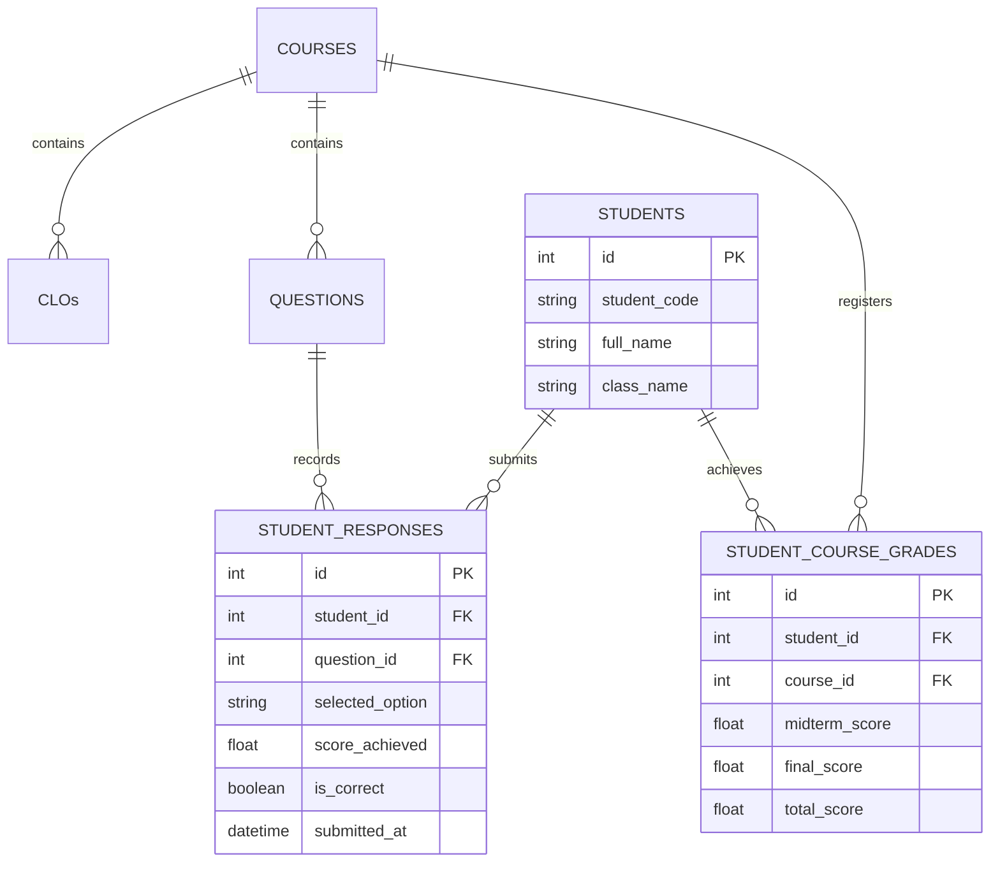

# 3. Đặc tả Chỉ số Đo lường & Cấu trúc Dữ liệu Hệ thống (Metrics & Schema Specification)

> [!NOTE]
> **Tài liệu Nghiên cứu Chuyên sâu**  
> **Phiên bản:** 1.0 (Bản thảo Hệ thống Phân tích & Tối ưu Bài giảng)  
> **Phát triển bởi:** Ban Nghiên cứu & Phát triển VinUni AI Lecture Assistant (Senior BA, Experienced Lecturer & Senior Full Stack)

---

Tài liệu này đặc tả chi tiết các công thức toán học đo lường chất lượng giảng dạy, cách truy vấn dữ liệu dựa trên **Schema hiện tại** của hệ thống VinUni AI Lecture Assistant, và đề xuất **Schema mở rộng trong tương lai** để lưu trữ kết quả thi của sinh viên.

---

## 1. Các Công thức Toán học Đo lường Giáo dục (Educational Metrics)

Hệ thống sử dụng 5 công thức cốt lõi để tự động đánh giá và cảnh báo giảng viên về các bài giảng cần cải tiến:

### A. Chỉ số Độ khó của Câu hỏi (Difficulty Index - $p$)
Đo lường tỷ lệ sinh viên làm đúng một câu hỏi trắc nghiệm hoặc tự luận ngắn.

$$p_i = \frac{N_{correct, i}}{N_{total}}$$

*Trong đó:*
*   $p_i$: Độ khó của câu hỏi $i$ ($0.0 \le p_i \le 1.0$).
*   $N_{correct, i}$: Số sinh viên làm đúng câu hỏi $i$.
*   $N_{total}$: Tổng số sinh viên tham gia làm bài kiểm tra.
*   *Ngưỡng cảnh báo:* Nếu $p_i < 0.3$ (Quá khó, cần giảng lại khái niệm) hoặc $p_i > 0.85$ (Quá dễ, cần tăng độ thử thách nhận thức).

### B. Chỉ số Phân hóa Câu hỏi (Discrimination Index - $d$)
Đánh giá xem câu hỏi có phân biệt được học sinh giỏi và học sinh kém hay không.

$$d_i = p_{high, i} - p_{low, i} = \frac{N_{high\_correct, i}}{N_{high}} - \frac{N_{low\_correct, i}}{N_{low}}$$

*Trong đó:*
*   $N_{high}$: Số sinh viên trong nhóm điểm cao (Top 27% tổng điểm bài thi).
*   $N_{low}$: Số sinh viên trong nhóm điểm thấp (Bottom 27% tổng điểm bài thi).
*   $N_{high\_correct, i}$: Số sinh viên nhóm điểm cao làm đúng câu $i$.
*   $N_{low\_correct, i}$: Số sinh viên nhóm điểm thấp làm đúng câu $i$.
*   *Ngưỡng cảnh báo:* Nếu $d_i < 0.2$, câu hỏi có vấn đề về mặt định hình hoặc gây hiểu nhầm (cần sửa đổi nội dung giảng dạy hoặc câu hỏi).

### C. Hiệu năng đạt chuẩn đầu ra (CLO Achievement Score - $CAS$)
Đo lường mức độ đạt chuẩn đầu ra môn học của một tập thể lớp.

$$CAS_k = \frac{\sum_{j \in Q_k} p_j \cdot w_j}{\sum_{j \in Q_k} w_j} \times 100\%$$

*Trong đó:*
*   $CAS_k$: Điểm đạt chuẩn của chuẩn đầu ra $CLO_k$ ($0\% \le CAS_k \le 100\%$).
*   $Q_k$: Tập hợp các câu hỏi thi/kiểm tra được ánh xạ trực tiếp tới $CLO_k$.
*   $p_j$: Chỉ số độ khó (tỷ lệ đúng) của câu hỏi $j$.
*   $w_j$: Trọng số điểm (Max score) của câu hỏi $j$ trong tổng bài thi.
*   *Ngưỡng cảnh báo:* Nếu $CAS_k < 70\%$, bài giảng liên quan tới $CLO_k$ bắt buộc phải được thiết kế lại.

### D. Tỷ lệ Hiệu quả của Phương án Nhiễu (Distractor Efficiency - $DE$)
Đánh giá mức độ hoạt động của các phương án trả lời sai trong câu hỏi trắc nghiệm (MCQ). Một phương án nhiễu tốt phải thu hút ít nhất $5\%$ sinh viên nhóm điểm kém chọn.

$$DE_{i, m} = \frac{N_{low, i, m}}{N_{low}}$$

*Trong đó:*
*   $DE_{i, m}$: Mức độ hiệu quả của đáp án nhiễu $m$ ở câu hỏi $i$.
*   $N_{low, i, m}$: Số sinh viên trong nhóm điểm kém chọn đáp án nhiễu $m$.
*   *Ngưỡng cảnh báo:* Nếu $DE_{i, m} \ge 0.4$, chứng tỏ sinh viên bị nhầm lẫn nghiêm trọng giữa đáp án đúng và đáp án nhiễu $m$. Hệ thống cần gợi ý giảng viên tạo slide so sánh trực quan giữa 2 khái niệm này.

### E. Chỉ số Tương tác Học liệu (Engagement Rate - $ER$)
Đo lường mức độ tương tác của sinh viên đối với slide/tài liệu của một chương học trước khi lên lớp.

$$ER_c = \frac{\sum_{u \in Users} \min\left(1.0, \frac{T_{u, c}}{T_{required, c}}\right)}{N_{active\_users}} \times 100\%$$

*Trong đó:*
*   $ER_c$: Tỷ lệ tương tác chương học $c$ ($0\% \le ER_c \le 100\%$).
*   $T_{u, c}$: Tổng thời gian sinh viên $u$ đọc slide của chương $c$ trên hệ thống.
*   $T_{required, c}$: Thời gian đọc tiêu chuẩn được thiết lập bởi giảng viên (ví dụ: 1 phút cho mỗi trang slide, chương có 15 slide thì $T_{required, c} = 15$ phút).
*   *Ngưỡng cảnh báo:* Nếu $ER_c < 50\%$, kịch bản giảng dạy buổi học cần chuyển sang chế độ kích hoạt tương tác trực tiếp nhiều hơn để bù đắp kiến thức thiếu hụt.

---

## 2. Đo lường dựa trên Schema hiện tại của Hệ thống

Dựa trên cấu trúc SQLite hiện tại (file [models.py](file:///c:/Users/Admin/Documents/VinUni/CodeLab/C2-App-023/src/database/models.py)), chúng ta có thể đo lường một số chỉ số vận hành và mức độ cải tiến bài giảng của giảng viên như sau:

### Chỉ số Chấp nhận Gợi ý AI (AI Suggestion Acceptance Rate - $ASAR$)
Đo lường mức độ hữu ích của nội dung slide do AI đề xuất dựa trên bảng `ai_generation_traces`.

*   **Câu lệnh SQL tính tỷ lệ chấp nhận slide của AI:**
```sql
SELECT 
    course_id,
    COUNT(*) as total_generations,
    SUM(CASE WHEN edited_content IS NULL OR edited_content = proposed_content THEN 1 ELSE 0 END) as direct_accepts,
    SUM(CASE WHEN edited_content IS NOT NULL AND edited_content != proposed_content THEN 1 ELSE 0 END) as modified_accepts,
    AVG(rating) as avg_rating
FROM ai_generation_traces
GROUP BY course_id;
```

*   **Ý nghĩa nghiệp vụ:** Nếu một môn học có tỷ lệ sửa đổi bài giảng cao ($> 80\%$), chứng tỏ prompt sinh bài giảng hiện tại của AI chưa khớp với phong cách giảng dạy của giảng viên. Hệ thống sẽ tự động cập nhật bảng `system_rules` để tinh chỉnh prompt hệ thống cho môn học đó.

---

## 3. Thiết kế Schema Mở rộng trong Tương lai (Future Database Schema)

Để đo lường kết quả thi thực tế của sinh viên và tích hợp vào thuật toán đề xuất thay đổi bài giảng của LangGraph Agent, chúng ta cần mở rộng cơ sở dữ liệu với các bảng sau:



### Mã nguồn định nghĩa Model SQLAlchemy (Mở rộng)

Giảng viên và nhà phát triển có thể tích hợp các class sau vào [models.py](file:///c:/Users/Admin/Documents/VinUni/CodeLab/C2-App-023/src/database/models.py) để chạy migration:

```python
# Cấu trúc đề xuất thêm vào database/models.py để lưu trữ kết quả thi sinh viên

class Student(Base):
    """Bảng lưu trữ thông tin sinh viên tham gia khóa học."""
    __tablename__ = "students"

    id = Column(Integer, primary_key=True, autoincrement=True)
    student_code = Column(String(50), unique=True, nullable=False, index=True)
    full_name = Column(String(150), nullable=False)
    class_name = Column(String(50), nullable=True) # Tên lớp hành chính (ví dụ: CS2022)
    created_at = Column(DateTime, server_default=func.now())

    # Quan hệ
    responses = relationship("StudentResponse", back_populates="student", cascade="all, delete-orphan")
    grades = relationship("StudentCourseGrade", back_populates="student", cascade="all, delete-orphan")


class StudentResponse(Base):
    """Bảng lưu chi tiết từng câu trả lời của sinh viên trong đề thi trắc nghiệm hoặc bài tập."""
    __tablename__ = "student_responses"

    id = Column(Integer, primary_key=True, autoincrement=True)
    student_id = Column(Integer, ForeignKey("students.id", ondelete="CASCADE"), nullable=False, index=True)
    question_id = Column(Integer, ForeignKey("questions.id", ondelete="CASCADE"), nullable=False, index=True)
    
    selected_option = Column(String(50), nullable=True)  # Đáp án sinh viên đã chọn (A, B, C, D)
    score_achieved = Column(Float, nullable=False, default=0.0)  # Điểm đạt được cho câu này
    is_correct = Column(Boolean, nullable=False, default=False)  # Đánh dấu đúng/sai
    submitted_at = Column(DateTime, server_default=func.now())

    # Quan hệ
    student = relationship("Student", back_populates="responses")
    question = relationship("Question", back_populates="responses") # Cần định nghĩa relationship tương ứng ở Question class


class StudentCourseGrade(Base):
    """Bảng tổng hợp điểm số tổng quan môn học của từng sinh viên."""
    __tablename__ = "student_course_grades"

    id = Column(Integer, primary_key=True, autoincrement=True)
    student_id = Column(Integer, ForeignKey("students.id", ondelete="CASCADE"), nullable=False, index=True)
    course_id = Column(Integer, ForeignKey("courses.id", ondelete="CASCADE"), nullable=False, index=True)
    
    midterm_score = Column(Float, nullable=True)
    final_score = Column(Float, nullable=True)
    total_score = Column(Float, nullable=True)
    
    updated_at = Column(DateTime, server_default=func.now(), onupdate=func.now())

    # Quan hệ
    student = relationship("Student", back_populates="grades")
    course = relationship("Course")
```

Bản mở rộng này cho phép hệ thống lập trình các hàm thống kê tự động (Analytics Engine) để quét và phát hiện ra chính xác những slide bài giảng nào đang liên kết tới các câu hỏi có tỷ lệ sai cao nhất của sinh viên, làm cơ sở dữ liệu đầu vào cho AI Agent đề xuất thay đổi.
