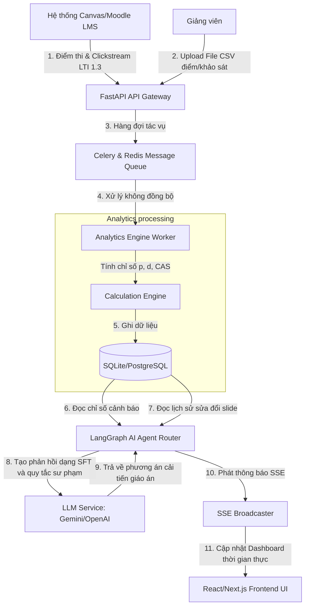
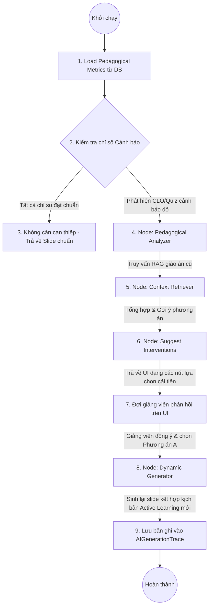

# 4. Kiến trúc Hệ thống & Vòng lặp Khuyến nghị AI (Architecture & AI Adaptive Loop)

> [!NOTE]
> **Tài liệu Nghiên cứu Chuyên sâu**  
> **Phiên bản:** 1.0 (Bản thảo Hệ thống Phân tích & Tối ưu Bài giảng)  
> **Phát triển bởi:** Ban Nghiên cứu & Phát triển VinUni AI Lecture Assistant (Senior BA, Experienced Lecturer & Senior Full Stack)

---

Tài liệu này trình bày giải pháp kiến trúc phần mềm tích hợp phân tích sư phạm vào hệ thống **VinUni AI Lecture Assistant** và cách xây dựng vòng lặp phản hồi tự động (Adaptive Loop) bằng AI Agent (LangGraph).

---

## 1. Sơ đồ Kiến trúc Tích hợp Dữ liệu học tập

Để hỗ trợ việc tự động thu thập điểm số, phản hồi khảo sát và tương tác của sinh viên từ LMS (Canvas/Moodle), hệ thống sử dụng kiến trúc luồng dữ liệu sau:



### Chi tiết các tầng kiến trúc chính:
1.  **Tầng thu thập dữ liệu (Ingestion Layer):**
    *   **LTI 1.3 Tool Standard:** Endpoint nhận JWT payload từ Canvas chứa điểm số chi tiết từng câu trắc nghiệm của sinh viên ngay sau khi bài thi kết thúc.
    *   **CSV Import Endpoint:** Cho phép giảng viên upload trực tiếp file xuất bảng điểm từ Excel nếu trường chưa cấu hình LTI.
2.  **Tầng tính toán & Phân tích (Analytics Engine Worker):**
    *   Sử dụng Celery Task chạy nền để tránh blocking FastAPI main thread khi phải xử lý bảng dữ liệu điểm số khổng lồ (hàng ngàn sinh viên x hàng trăm câu hỏi).
    *   Thực hiện tính toán các chỉ số toán học ($p$, $d$, $DE$, $CAS$, $ER$) định kỳ hoặc ngay sau khi có dữ liệu mới.
3.  **Vòng lặp AI thông minh (AI Adaptive Loop - LangGraph Node):**
    *   Tích hợp Node phân tích sư phạm (`pedagogical_analyzer_node`) vào Luồng LangGraph Agent hiện tại.
    *   Node này so sánh các chỉ số thực tế của sinh viên với ngưỡng cảnh báo. Nếu phát hiện bất thường, nó sẽ tự động truy vấn bài giảng tương ứng từ bảng `chapter_materials` để chuẩn bị nội dung gợi ý tái cấu trúc.

---

## 2. Thiết kế luồng LangGraph Agent Phân tích & Tái cấu trúc Bài giảng

Khi giảng viên truy cập vào giao diện chương học, LangGraph Agent sẽ tự động chạy ngầm một tác vụ đánh giá. Dưới đây là cách trạng thái Agent (`AgentState`) lưu giữ thông tin học tập và thực thi:

### Định nghĩa AgentState mở rộng

```python
# Cấu trúc State của LangGraph Agent mở rộng hỗ trợ Pedagogical Analytics
from typing import TypedDict, List, Dict, Any

class PedagogicalAgentState(TypedDict):
    course_id: int
    chapter_id: int
    messages: List[Dict[str, Any]]
    
    # Dữ liệu phân tích sư phạm được nạp tự động từ Analytics Engine
    poor_performing_clos: List[Dict[str, Any]] # Danh sách CLO có CAS < 70%
    difficult_questions: List[Dict[str, Any]]     # Danh sách câu hỏi có p < 0.3
    student_misconceptions: List[Dict[str, Any]]  # Cảnh báo dựa trên Distractor Analysis
    engagement_metrics: Dict[str, Any]            # Chỉ số tương tác (Engagement Rate)
    
    # Trạng thái gợi ý đề xuất
    proposed_interventions: List[Dict[str, Any]]  # Các lựa chọn cải tiến đề xuất cho giảng viên
    chosen_intervention: Dict[str, Any]           # Phương án cải tiến giảng viên đã bấm chọn
    
    # Kết quả slide mới được sinh
    regenerated_slide_content: str
```

### Flow sơ đồ hoạt động của LangGraph Agent Node:



---

## 3. Bản vẽ Giao diện Trực quan hóa (UI/UX Dashboard Mockup)

Dưới đây là thiết kế giao diện dạng bảng điều khiển (Dashboard) dành cho giảng viên sử dụng trên **React/Next.js Frontend**. Giao diện này làm nổi bật các điểm nghẽn sư phạm và cung cấp công cụ tương tác 1-Click để AI sinh lại nội dung giảng dạy.

```markdown
+-----------------------------------------------------------------------------------------+
| [ VinUni AI Lecture Assistant ]  Course: CS102 - Intro to Python | Semester: Fall 2026   |
+-----------------------------------------------------------------------------------------+
| [Dashboard]  [Course Roadmap]  [Lesson Planner]  [Question Bank]   (Active: Lecturer)   |
+-----------------------------------------------------------------------------------------+
|                                                                                         |
|  PEDAGOGICAL PERFORMANCE & AUDIT REPORT                                                 |
|  -------------------------------------------------------------------------------------  |
|                                                                                         |
|  [!] WARNING: Student performance drops below 70% threshold in 2 Chapters.             |
|                                                                                         |
|  +-----------------------------------------------------------------------------------+  |
|  | CHAPTER 3: Loops & Control Flow (CLO2 - Bloom Level 3: Application)               |  |
|  |-----------------------------------------------------------------------------------|  |
|  | - Student Achievement (CAS): 58.2% [Critical Alert]                               |  |
|  | - Question Difficulty (Avg p): 0.28 (Students struggle with nested loops quiz)     |  |
|  | - Student Dwell Time: 3.2 mins/slide (Very low engagement with textbook slides)   |  |
|  | - Common Misconception: 68% of students fail to increment loop index in MCQ #5.   |  |
|  |                                                                                   |  |
|  | >>> [ AI RECOMMENDATION ]                                                         |  |
|  | "Slide 7 & 8 contain too much static text. Sinh viên bị quá tải nhận thức.          |  |
|  |  Đề xuất: Chuyển đổi slide lý thuyết vòng lặp sang sơ đồ trực quan và chèn         |  |
|  |  kịch bản Peer Instruction (Sinh viên thảo luận đôi trả lời câu hỏi MCQ số 5)."   |  |
|  |                                                                                   |  |
|  | [ OPTION A: Add Interactive Comparison Diagram & SFT common mistake slide ]       |  |
|  | [ OPTION B: Insert Active Learning Coding Lab Script (5 mins practice) ]          |  |
|  | [ OPTION C: Downgrade Bloom Level 3 to Level 2 (Focus on Reading Code) ]           |  |
|  |                                                                                   |  |
|  |                                                        [ Apply Selected Method ]  |  |
|  |                                                                                   |  |
|  +-----------------------------------------------------------------------------------+  |
|                                                                                         |
|  +-----------------------------------------------------------------------------------+  |
|  | CHAPTER 4: Functions & Scope (CLO3 - Bloom Level 3: Application)                  |  |
|  |-----------------------------------------------------------------------------------|  |
|  | - Student Achievement (CAS): 64.5% [Warning Alert]                                |  |
|  | - Distractor Analysis: Students mix up local scope with global scope (Distractor B)|  |
|  |                                                                                   |  |
|  | >>> [ AI RECOMMENDATION ]                                                         |  |
|  | "Slide 12: Thêm bảng so sánh phạm vi Local và Global kèm code demo trực quan."     |  |
|  |                                                                                   |  |
|  |                                                      [ Optimize Slide via AI ]    |  |
|  +-----------------------------------------------------------------------------------+  |
|                                                                                         |
+-----------------------------------------------------------------------------------------+
```

### Cơ chế Tương tác của Frontend Dashboard:
1.  **Chỉ báo cảnh báo sớm (Early-warning Indicators):** Sử dụng mã màu (Đỏ cho nguy cấp CAS $< 60\%$, Cam cho cảnh báo $60\% \le CAS < 70\%$, Xanh cho đạt chuẩn) để thu hút sự tập trung của giảng viên vào các bài giảng bị lỗi.
2.  **Khớp mã lỗi tự động (Mismatch mapping):** Khi click vào `Optimize Slide via AI`, frontend sẽ gửi mã định danh của Slide bị lỗi và mã câu hỏi thi học sinh làm kém lên Backend. Backend tự động map slide đó với Chromadb context để điều chỉnh.
3.  **Vòng lặp phản hồi SFT:** Khi giảng viên bấm áp dụng, AI sinh slide mới, giảng viên chỉnh sửa thủ công. Sự khác biệt giữa Slide đề xuất ban đầu và Slide sau khi sửa được ghi lại thành cặp dữ liệu `proposed_content` và `edited_content` trong `ai_generation_traces` để tối ưu hóa trọng số prompt của mô hình ngôn ngữ lớn (LLM) sau này.
